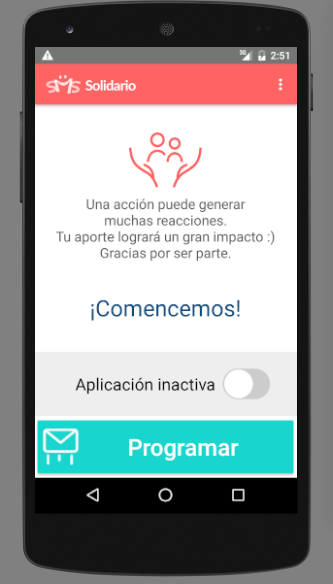

# Overview

SMS Solidario is an app that was created with the objective of donating to an organization that helps the community the cell phone credit that was not used and left over from a monthly cell phone plan by a user.  The user can choose the organization that will receive the donation by entering the cell phone number that corresponds to the organization's donation phone. Any idea or pull request is more than welcome! :)

# Code style guide:
    https://github.com/ribot/android-guidelines/blob/master/project_and_code_guidelines.md

    Note: The guide recommends a 4 spaces indentation but the correct indentation for the project
    is 2 spaces
